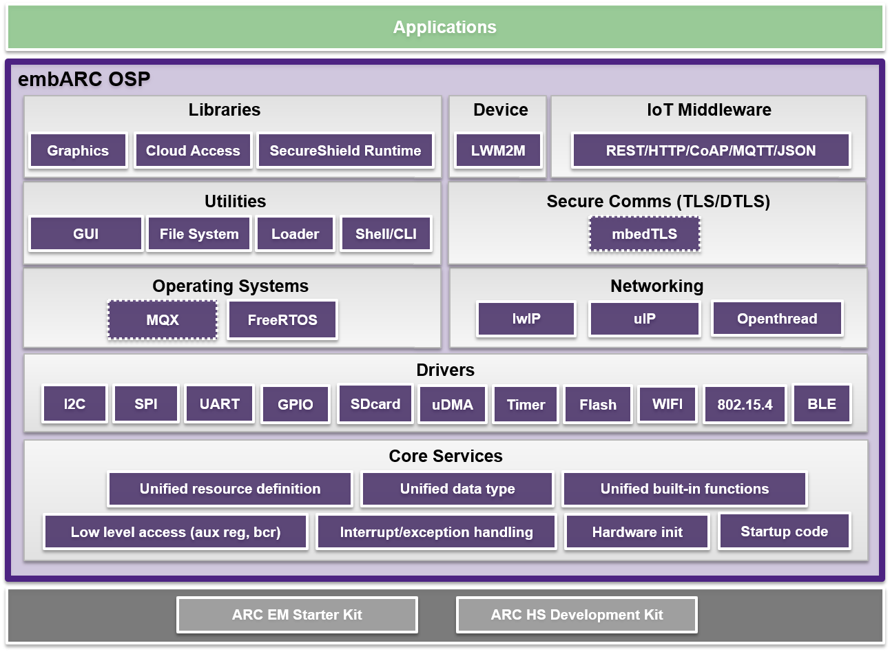

# embARC Open Software Platform (OSP)

## Introduction
The embARC Open Software Platform (OSP) is a software distribution aimed at facilitating the development of embedded systems based on ARCv2 Processors.

It is designed to provide a unified platform for ARCv2 users by defining consistent and simple software interfaces to the processor and peripherals, together with ports of several well known FOSS embedded software stacks to ARCv2 Processors.

embARC OSP provides a comprehensive foundation for embedded developers, simplifying development and improving time to market through software reuse.
## embARC OSP Architecture
The embARC Open Software Platform general architecture and components is shown in the block diagram below.

### ARC Hardware Abstraction Layer
This layer provides standard interfaces and definitions for ARCv2 processors.
### Device Hardware Abstraction Layer
This layer defines the interfaces and definitions for peripherals such as UART, I2C, GPIO, SPI, and WNIC. This layer simply defines the interfaces of device drivers, but does not contain detailed device driver implementations. Driver implementation is left to the application. A group of driver implementations for supported DesignWare IP peripherals are provided as a reference.
### Operating System Layer
This layer contains the support for embedded operating systems.
### Common Library Layer
This layer provides stubs for various support library implementations such as C library, Secureshield runtime library for security, math library, Floating Point or other libraries. These libraries can be bare-metal or OS based implementations.
### Middleware Layer
This layer integrates different embedded middleware, such as Shell/Command Line Interface (CLI), file systems, networking and IoT communication protocol stacks.
## How to Use embARC OSP
The embARC OSP software includes several examples to help the user get up and running quickly with embARC OSP. Please refer to [embARC OSP Documentation](http://foss-for-synopsys-dwc-arc-processors.github.io/embarc_osp) and [embARC OSP Wiki](https://github.com/foss-for-synopsys-dwc-arc-processors/embarc_osp/wiki) for more information, or you can generate the latest documentation by yourself following this guide.
## Contribute to embARC OSP
We welcome community contributions to embARC OSP. Please check out the [Contributing to embARC OSP](.github/CONTRIBUTING.md) for guidelines on how to proceed.
Users participating in the embARC Community and its sub-projects codebases and issue trackers are expected to follow the [embARC code of conduct](.github/CODE_OF_CONDUCT.md).
